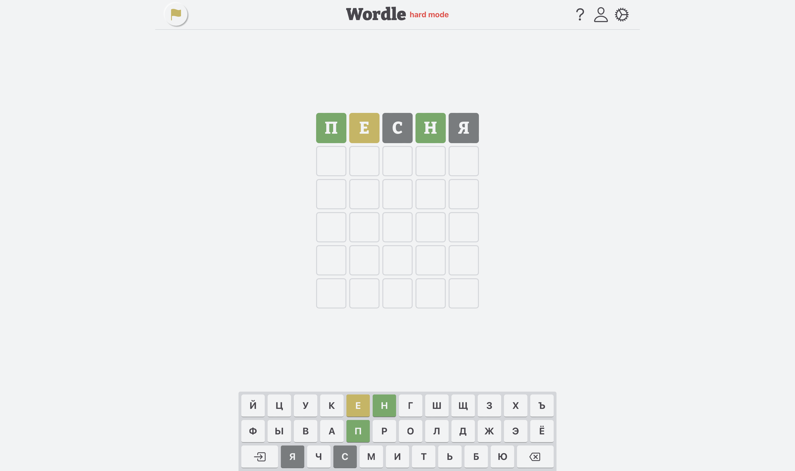

# Головоломка Wordle



Головоломка Wordle - захватывающая и увлекательная игра, которая проверит вашу способность разгадывать слова и угадывать загаданные комбинации. Вдохновленная популярной онлайн-игрой, эта версия Wordle предоставляет вам возможность испытать свои лингвистические навыки и логическое мышление.

Цель игры проста: вы должны угадать загаданное слово, имея ограниченное количество попыток. Каждая попытка состоит из предложения слова, и игра сообщает вам, правильно ли вы угадали буквы и их положение в слове. Ваша задача - с помощью подсказок и логического рассуждения отгадать слово за наименьшее количество попыток.

## Демо

Поиграть можно здесь [wordle-by-ds.ru](https://www.wordle-by-ds.ru/)

## Возможности

- **Темная тема**: Поддержка темной темы для удобства использования проекта в условиях низкого освещения или просто по предпочтению пользователей.
- **Авторизация**: Реализована система авторизации, построенная на использовании JSON Web Token (JWT) для обеспечения безопасности и аутентификации пользователей. Пользователи могут создавать учетные записи, входить в систему с помощью своих учетных данных и получать JWT-токены для доступа к защищенным ресурсам проекта. Кроме того, в системе предусмотрена возможность подтверждения учетной записи путем отправки электронного письма с подтверждающей ссылкой на адрес электронной почты, указанный пользователем.
- **Повышение уровня сложности**: Возможность повышения уровня сложности игры связана с необходимость использовать все полученные подсказки в следующей попытке.
- **Статистика**: Ведется статистика результатов игры, включая общее количество сыгранных партий, количество выигрышных партий и количество попыток для успешного завершения игры.
- **Рейтинг игроков**: Введен рейтинг игроков, где отображаются их результаты, включая количество побед и поражений. Игроки могут соревноваться и стремиться к лучшим показателям.
- **Административный блок**: Реализован небольшой административный блок, предоставляющий администратору возможность управлять игрой. В административном блоке администратор может добавлять и удалять слова из базы данных, просматривать информацию о зарегистрированных игроках.

## Установка

1. Клонируйте репозиторий с GitHub `git clone https://github.com/DenisShamanskiy/react-demo-wordle`

2. Установите зависимости

```sh
npm install
```

3. Соберите проект

```sh
npm run build
```

4. Запустите проект локально

```sh
serve -s build
```

## Инструменты и технологии


# Лицензия


